# ZhaBlog
扎扎博客 JavaEE期末大作业

### 功能描述

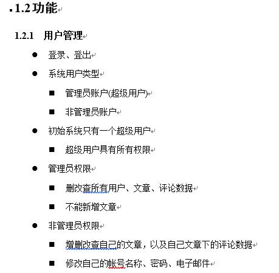

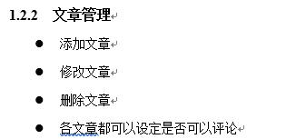

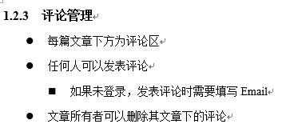

### 环境

前端: bootstrap3

后端: springboot2.1.10

### 具体实现

#### 主界面

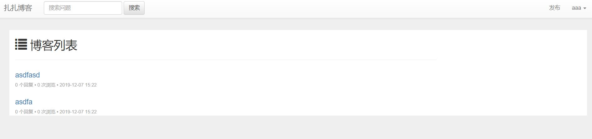

#### 登录注册

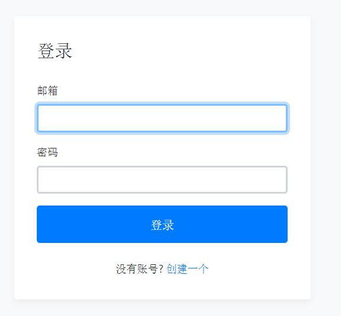

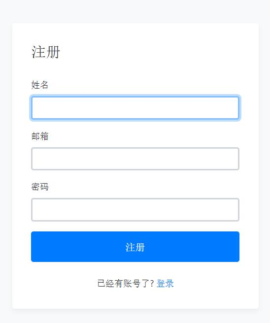

#### 博客内容

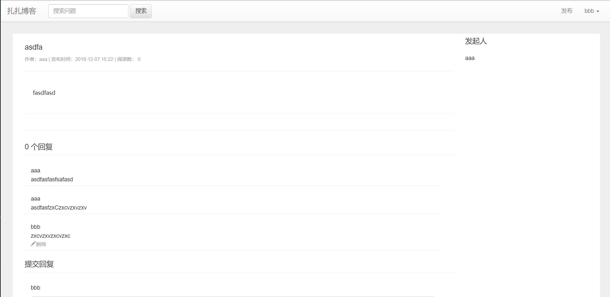

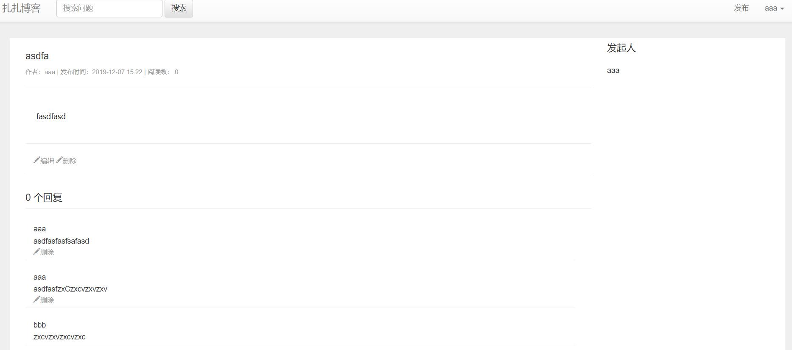

> 这里说明一下:
>
> 这两个账号都是普通账号
>
> 只能删除自己的博客和评论
>
> 无法删除别人的 所以是这个样子

#### 个人中心

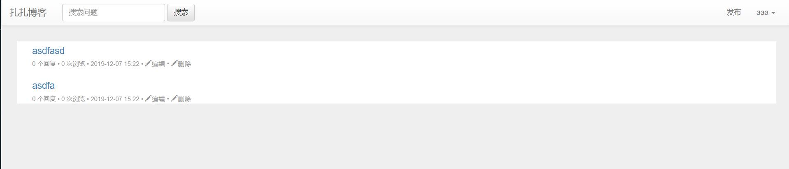

#### 发布博客

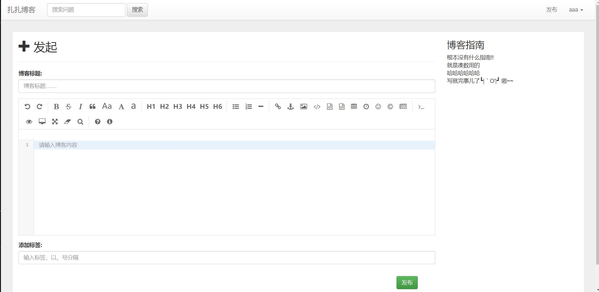

#### 管理界面

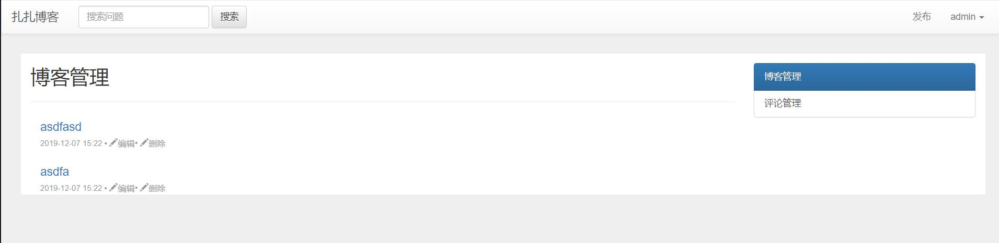

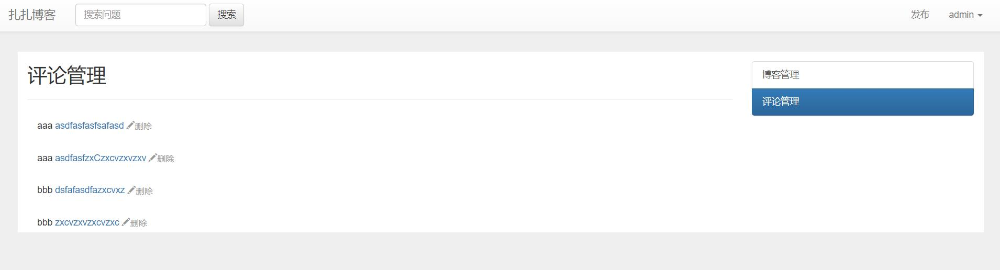

> 在这里说明一下
>
> 数据库中有一个字段叫isAdmin
>
> 来判断是否为admin 而不是简单的名字判断